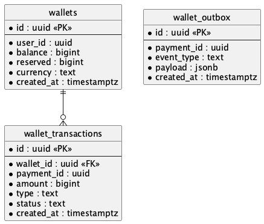
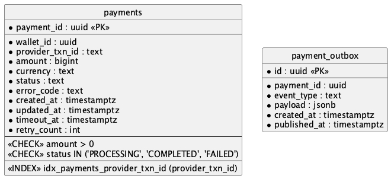
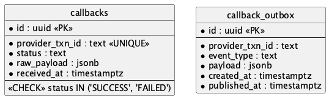
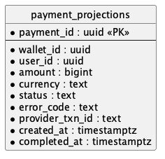
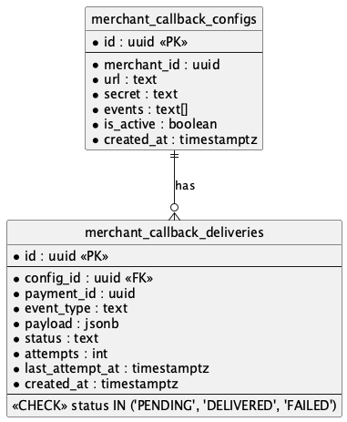

# Database

## Identifiers (UUIDv7)

**Требования:**

- Глобально уникален
- Сортируем по времени
- Не требует централизованного генератора в БД

**Решение:** UUIDv7 — timestamp в первых 48 битах. Генерируется на любом сервисе без координации.

| Система       | Применение                            |
| ------------- | ------------------------------------- |
| Payments DB   | PRIMARY KEY                           |
| Wallet        | Связь reserve/commit через payment_id |
| Kafka         | Ключ партицирования                   |
| Логи/трейсинг | payment_id для поиска                 |

**Производительность:** Локальность вставок как у sequence (timestamp в начале). Размер 16 byte vs 8 byte.

**Миграция:** Старые ID сохраняем с маппингом sequence → UUIDv7. Новые API только UUIDv7.

## Wallet DB

### wallets

| Field      | Type        | Описание                                |
| ---------- | ----------- | --------------------------------------- |
| id         | uuid        | PK                                      |
| user_id    | uuid        | Владелец кошелька                       |
| balance    | bigint      | Доступный баланс в минимальных единицах |
| reserved   | bigint      | Зарезервированная сумма                 |
| currency   | text        | Код валюты (RUB, USD, ...)              |
| created_at | timestamptz | Время создания                          |

**Индексы:**

- `idx_wallets_user_id` — для поиска кошельков пользователя (GET /users/{id}/wallets)

### reservations

| Field        | Type        | Описание                          |
| ------------ | ----------- | --------------------------------- |
| id           | uuid        | PK                                |
| payment_id   | uuid        | UNIQUE — один reserve на платёж   |
| wallet_id    | uuid        | FK → wallets                      |
| amount       | bigint      | Сумма резервации                  |
| status       | text        | RESERVED, COMMITTED, RELEASED     |
| created_at   | timestamptz | Время создания                    |
| committed_at | timestamptz | Время commit (null если не было)  |
| released_at  | timestamptz | Время release (null если не было) |

**Индексы:**

- `idx_reservations_wallet_id` — для поиска резерваций по кошельку
- `idx_reservations_status` — для поиска активных резерваций

### wallet_outbox

| Field        | Type        | Описание                      |
| ------------ | ----------- | ----------------------------- |
| id           | uuid        | PK                            |
| payment_id   | uuid        | ID платежа                    |
| event_type   | text        | PaymentInitiated              |
| payload      | jsonb       | Данные события                |
| created_at   | timestamptz | Время создания                |
| published_at | timestamptz | Когда опубликовано (или null) |

## Payment DB

### payments

| Field           | Type        | Описание                        |
| --------------- | ----------- | ------------------------------- |
| payment_id      | uuid        | PK (из Wallet/PaymentInitiated) |
| wallet_id       | uuid        | ID кошелька                     |
| provider_txn_id | text        | ID транзакции от провайдера     |
| amount          | bigint      | Сумма                           |
| currency        | text        | Код валюты                      |
| status          | text        | PROCESSING, COMPLETED, FAILED   |
| error_code      | text        | Код ошибки                      |
| created_at      | timestamptz | Время создания                  |
| timeout_at      | timestamptz | Когда истёк таймаут callback'а  |
| retry_count     | int         | Количество проверок статуса     |

**Индексы:**

- `idx_payments_provider_txn_id` — для поиска по ID от провайдера (при получении callback)

### payment_outbox

| Field      | Type        | Описание                        |
| ---------- | ----------- | ------------------------------- |
| id         | uuid        | PK                              |
| payment_id | uuid        | ID платежа                      |
| event_type | text        | PaymentCompleted, PaymentFailed |
| payload    | jsonb       | Данные события                  |
| created_at | timestamptz | Время создания                  |

## Callback DB

### callbacks

| Field           | Type        | Описание                    |
| --------------- | ----------- | --------------------------- |
| id              | uuid        | PK                          |
| provider_txn_id | text        | ID транзакции от провайдера |
| status          | text        | SUCCESS, FAILED             |
| raw_payload     | jsonb       | Сырой ответ от провайдера   |
| received_at     | timestamptz | Время получения             |

### callback_outbox

| Field           | Type        | Описание                    |
| --------------- | ----------- | --------------------------- |
| id              | uuid        | PK                          |
| provider_txn_id | text        | ID транзакции от провайдера |
| event_type      | text        | ProviderCallbackReceived    |
| payload         | jsonb       | Данные события              |
| created_at      | timestamptz | Время создания              |

## Query DB

### payment_projections

| Field           | Type        | Описание                                |
| --------------- | ----------- | --------------------------------------- |
| payment_id      | uuid        | PK                                      |
| wallet_id       | uuid        | ID кошелька                             |
| user_id         | uuid        | ID пользователя                         |
| amount          | bigint      | Сумма                                   |
| currency        | text        | Код валюты                              |
| status          | text        | RESERVED, PROCESSING, COMPLETED, FAILED |
| error_code      | text        | Код ошибки                              |
| provider_txn_id | text        | ID транзакции от провайдера             |
| created_at      | timestamptz | Время создания                          |
| completed_at    | timestamptz | Время завершения                        |

### Индексы

- `payment_id` — PK
- `CREATE INDEX idx_payment_projections_wallet_created ON payment_projections (wallet_id, created_at DESC);`

### Запросы

- `GET /payments/{paymentId}` -> `SELECT * FROM payment_projections WHERE payment_id = ?`
- `GET /payments?walletId={walletId}` -> `SELECT * FROM payment_projections WHERE wallet_id = ? ORDER BY created_at DESC LIMIT ? OFFSET ?`

## Merchant Callback DB

### merchant_callback_configs

| Field       | Type        | Описание                  |
| ----------- | ----------- | ------------------------- |
| id          | uuid        | PK                        |
| merchant_id | uuid        | ID мерчанта               |
| url         | text        | URL для доставки          |
| secret      | text        | Секрет для подписи        |
| events      | text[]      | Типы событий для отправки |
| is_active   | boolean     | Активен ли callback       |
| created_at  | timestamptz | Время создания            |

### merchant_callback_deliveries

| Field           | Type        | Описание                       |
| --------------- | ----------- | ------------------------------ |
| id              | uuid        | PK                             |
| config_id       | uuid        | FK → merchant_callback_configs |
| payment_id      | uuid        | ID платежа                     |
| event_type      | text        | Тип события                    |
| payload         | jsonb       | Данные для отправки            |
| status          | text        | PENDING, DELIVERED, FAILED     |
| attempts        | int         | Количество попыток             |
| last_attempt_at | timestamptz | Время последней попытки        |
| created_at      | timestamptz | Время создания                 |
