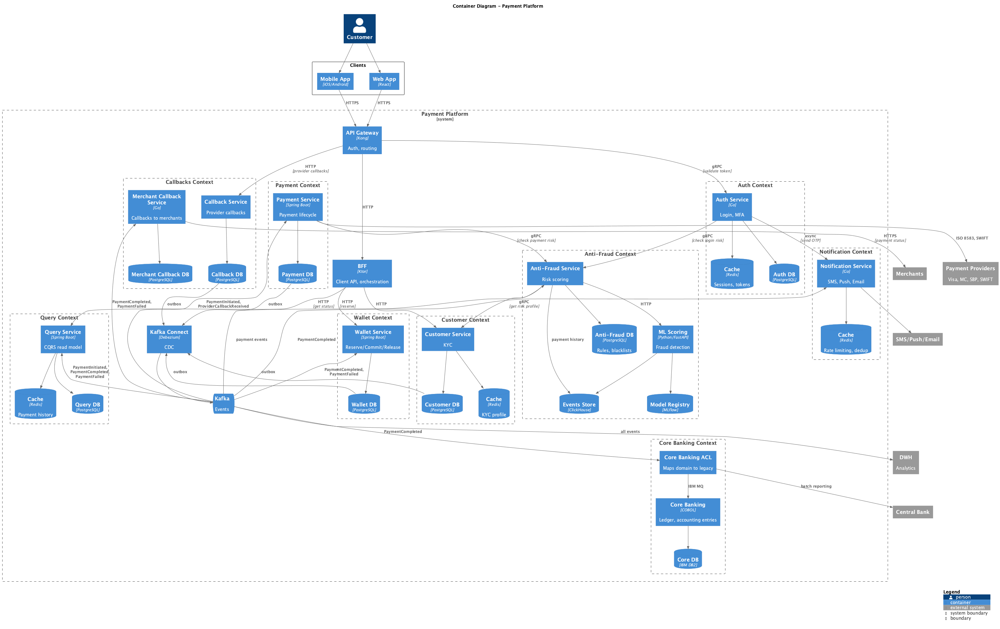
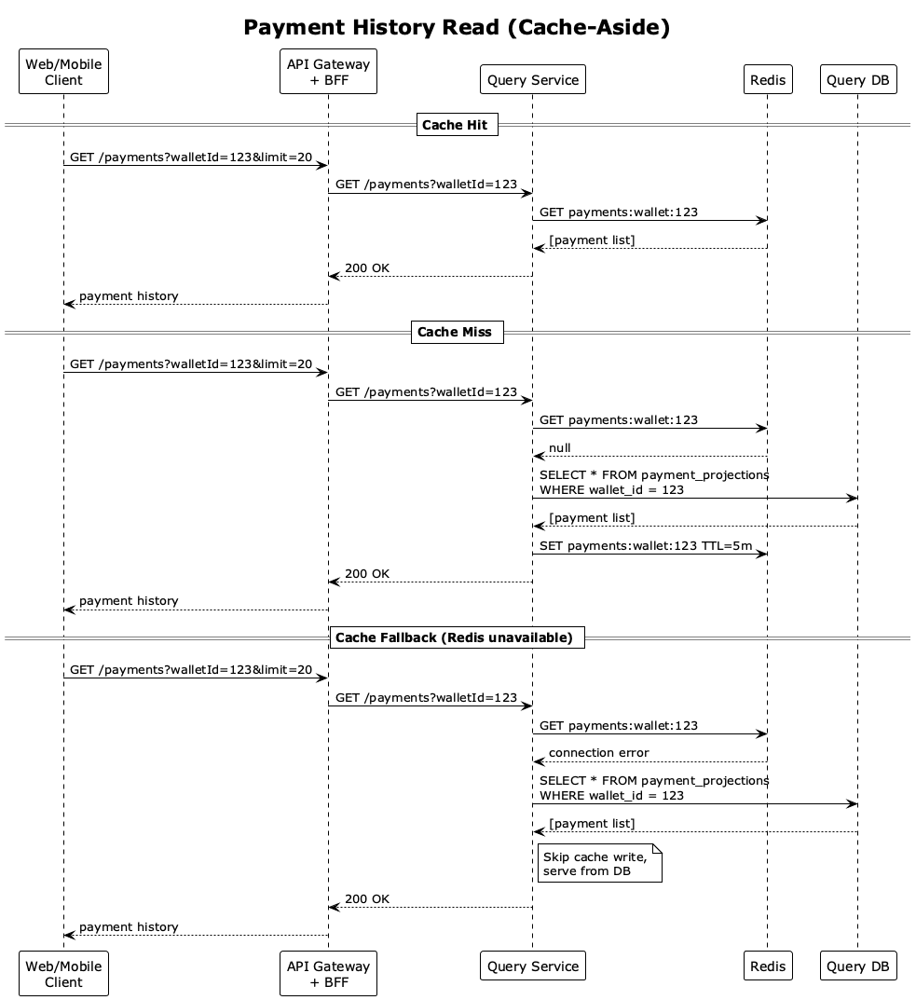

# Кэширование

Стратегии кэширования в платёжной системе.

## Где кэшируем

| Зона                        | Сервис               | Стратегия     | TTL |
| --------------------------- | -------------------- | ------------- | --- |
| История платежей            | Query Service        | Cache-Aside   | 5м  |
| Справочники (курсы, тарифы) | BFF                  | Cache-Aside   | 15м |
| Сессии, токены              | Auth Service         | Write-Through | 30м |
| KYC-профиль клиента         | Customer Service     | Cache-Aside   | 1ч  |
| Дедупликация уведомлений    | Notification Service | Write-Through | 24ч |

**История платежей (Query Service)**

1. Стратегия: Cache-Aside
   Потому что read-heavy нагрузка: клиенты часто читают историю, но редко создают новые платежи. Cache-Aside кэширует только то, что реально читают — не тратим память на редко запрашиваемые данные.

2. TTL: 5 минут
   Потому что история платежей — не real-time данные. Клиент может увидеть платёж с задержкой до 5 минут — это приемлемо.

3. Где хранится: Redis в Query Context

**Справочники — курсы, тарифы (BFF)**

1. Стратегия: Cache-Aside
   Потому что справочники редко меняются (курсы — раз в день, тарифы — раз в месяц), но читаются на каждый запрос. Cache-Aside эффективен для такого паттерна.

2. TTL: 15 минут
   Потому что BFF не подписан на события изменения справочников — нет механизма инвалидации. Короткий TTL гарантирует, что при внеплановом изменении курса (например, резкое изменение рынка) клиенты увидят новый курс максимум через 15 минут.

3. Где хранится: in-memory в BFF
   Потому что справочники маленькие (десятки записей), не нужен Redis. In-memory быстрее и проще.

**Сессии, токены (Auth Service)**

1. Стратегия: Write-Through
   Потому что токены критичны для каждого запроса (API Gateway проверяет на каждом вызове). Write-Through гарантирует что кэш всегда актуален — нет риска что токен отозван, но ещё в кэше.

2. TTL: 30 минут
   Потому что это время жизни access token. После 30 минут токен невалиден, кэш автоматически очищается.

3. Где хранится: Redis в Auth Context
   Потому что Auth Service — отдельный сервис, нужен shared cache. API Gateway читает из этого же Redis для валидации токенов.

**KYC-профиль клиента (Customer Service)**

1. Стратегия: Cache-Aside
   Потому что KYC-данные читаются часто (Anti-Fraud проверяет на каждый платёж), но меняются редко (клиент проходит верификацию один раз).

2. TTL: 1 час
   Потому что KYC-статус меняется редко. При изменении (например, блокировка клиента) — инвалидация через событие `CustomerUpdated`.

3. Где хранится: Redis в Customer Context

**Дедупликация уведомлений (Notification Service)**

1. Стратегия: Write-Through
   Потому что при отправке уведомления сразу записываем ключ `{customerId}:{paymentId}:{channel}` в кэш. Повторная попытка отправки проверяет кэш и пропускает дубликат.

2. TTL: 24 часа
   Потому что защищает от повторной отправки при retry из DLQ. 24ч достаточно — после этого повторное уведомление о том же платеже маловероятно.

3. Где хранится: Redis в Notification Context

## Что НЕ кэшируем

- Баланс кошелька
- Статус резерва

**Баланс кошелька**

1. Почему не кэшируем
   Потому что stale баланс нарушает денежные инварианты:
   - Клиент видит 1000₽, пытается заплатить 800₽
   - Реальный баланс 500₽ (уже был платёж)
   - Результат: ошибка на этапе резерва
     Потому что Wallet Service читает баланс из БД на каждый запрос. БД — source of truth для денег. Оптимизация через индексы, не через кэш.

**Статус резерва**

1. Почему не кэшируем
   Потому что stale статус резерва → двойное списание:
   - Резерв A в статусе RESERVED (в кэше)
   - Payment Service уже сделал commit → статус COMMITTED (в БД)
   - Другой процесс читает кэш, видит RESERVED, пытается commit повторно
     Потому что статус резерва проверяется редко (только при commit/release). Нет смысла кэшировать — нагрузка низкая, риск высокий.

**Write-Behind**

1. Почему не используем для платёжных данных
   Потому что Write-Behind пишет сначала в кэш, потом async в БД. При падении кэша до записи в БД — данные потеряны. Для денег недопустимо: платёж "прошёл" в кэше, клиент видит успех, но в БД ничего нет.

## Архитектура

Cache-слои (Redis) показаны на общей C2-диаграмме рядом с Query, Notification, Auth, Customer сервисами.

## Сценарий: чтение истории платежей

