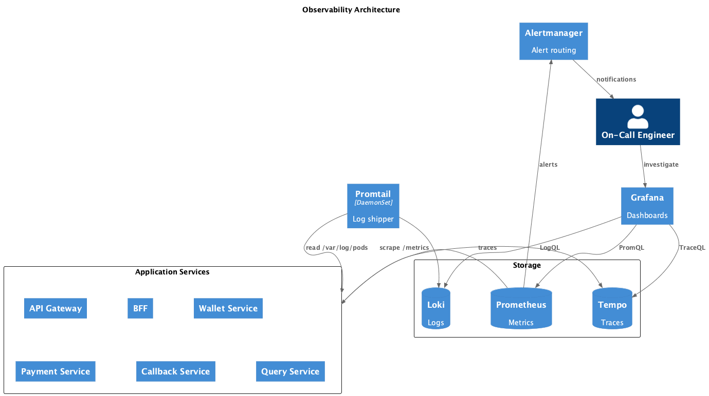
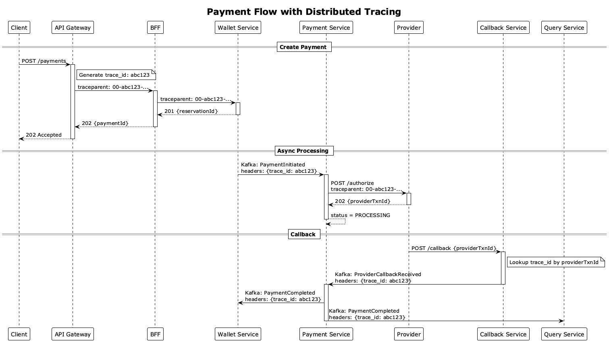

# Наблюдаемость

Метрики платёжной системы.

SLI/SLO: см. [resilience.md](resilience.md#slislo).

**Типы метрик:**

- **Counter** — только растёт (сбрасывается при рестарте). Пример: количество запросов.
- **Gauge** — текущее значение, растёт и падает. Пример: количество активных соединений.
- **Histogram** — распределение по бакетам для расчёта перцентилей (p50, p90, p99).

## Метрики по сервисам

### API Gateway

- `http_requests_total` — количество запросов
- `http_request_duration_seconds` — латентность (p50, p99)
- `rate_limit_exceeded_total` — срабатывания rate limit
- `active_connections` — активные соединения

### Wallet Service

- `wallet_reserve_total`, `wallet_commit_total`, `wallet_release_total` — операции
- `wallet_reserve_duration_seconds` — латентность резервирования
- `wallet_balance_check_failed` — отказы

### Payment Service

- `payment_created_total`, `payment_completed_total`, `payment_failed_total` — статусы платежей
- `payment_processing_duration_seconds` — время обработки (p50, p99)
- `payment_in_processing` — платежи в статусе PROCESSING

### Callback Service

- `callback_received_total` — полученные callback'и
- `callback_processing_duration_seconds` — латентность обработки
- `callback_signature_invalid_total` — невалидные подписи
- `callback_duplicate_total` — дубликаты

### Query Service

- `query_requests_total` — запросы по эндпоинтам
- `query_duration_seconds` — латентность
- `query_cache_hits_total`, `query_cache_misses_total` — cache hit/miss

## Метрики Kafka

- `kafka_consumer_lag` — отставание консьюмера
- `kafka_messages_consumed_total`, `kafka_messages_produced_total` — обработанные/опубликованные сообщения
- `kafka_consumer_processing_seconds` — время обработки сообщения
- `kafka_dlq_messages_total` — сообщения в DLQ

## Метрики внешнего провайдера

- `provider_calls_total` — вызовы (success/error)
- `provider_duration_seconds` — латентность (p50, p99)
- `provider_timeout_total` — таймауты
- `provider_circuit_breaker_state` — состояние Circuit Breaker
- `provider_retry_total` — количество retry

## Стек

| Компонент | Технология           | Назначение                                      |
| --------- | -------------------- | ----------------------------------------------- |
| Метрики   | Prometheus + Grafana | Сбор (pull) и визуализация метрик               |
| Логи      | Loki + Promtail      | Promtail (DaemonSet) собирает логи, Loki хранит |
| Трейсы    | Tempo                | Хранение трейсов, интеграция с Grafana          |
| Алерты    | Alertmanager         | Группировка, дедупликация, роутинг оповещений   |

**Почему этот стек:**

1. Prometheus
   Pull-модель с service discovery — новые сервисы автоматически обнаруживаются. PromQL для гибких запросов.

2. Loki + Promtail
   Promtail — DaemonSet на каждой ноде, читает логи из `/var/log/pods/*`, добавляет labels (pod, namespace). Loki индексирует только labels, не полный текст — дешевле ELK.

3. Tempo
   Хранит трейсы в S3 без индексации — дешевле Jaeger с Cassandra/Elasticsearch.

## Дашборды

**Типы панелей Grafana:**

- **Stat** — одно большое число
- **Time series** — график во времени
- **Heatmap** — распределение (для histogram)
- **Pie** — круговая диаграмма
- **Bar** — столбчатая диаграмма
- **State timeline** — история состояний

### Operational Dashboard

| Панель             | Тип         | Метрика                         |
| ------------------ | ----------- | ------------------------------- |
| Availability SLI   | Stat        | `http_requests_total`           |
| Latency p99        | Stat        | `http_request_duration_seconds` |
| Error Rate         | Time series | `http_requests_total`           |
| Kafka Consumer Lag | Time series | `kafka_consumer_lag`            |

### Provider Health Dashboard

| Панель             | Тип            | Метрика                          |
| ------------------ | -------------- | -------------------------------- |
| Success Rate       | Stat           | `provider_calls_total`           |
| Latency            | Heatmap        | `provider_duration_seconds`      |
| Errors by Code     | Pie            | `provider_errors_total`          |
| Circuit Breaker    | State timeline | `provider_circuit_breaker_state` |
| Retry Distribution | Bar            | `provider_retry_total`           |

Примеры дашбордов: [Operational](../../diagrams/dashboards/operational-dashboard.html), [Provider Health](../../diagrams/dashboards/provider-health-dashboard.html).

## Диаграммы

### Архитектура observability

### Сценарий: трейсинг платежа

Как `trace_id` проходит через все сервисы:

1. **Gateway** генерирует `trace_id` и создаёт первый span
2. **HTTP вызовы** — trace_id передаётся в `traceparent` header (W3C стандарт)
3. **Kafka** — trace_id в headers сообщения, чтобы не смешивать с бизнес-данными
4. **Callback от провайдера** — провайдер не знает наш trace_id. Callback Service создаёт новый trace, но восстанавливает оригинальный trace_id из БД по `providerTxnId`

В результате все spans от одного платежа связаны одним trace_id — можно увидеть полный путь запроса в Grafana.

