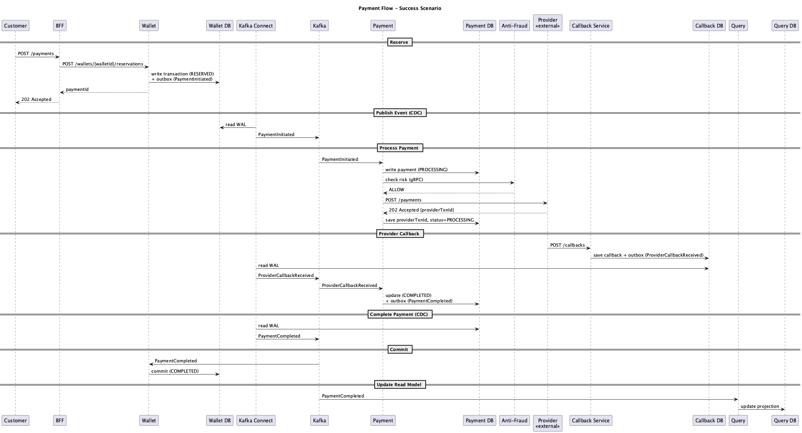
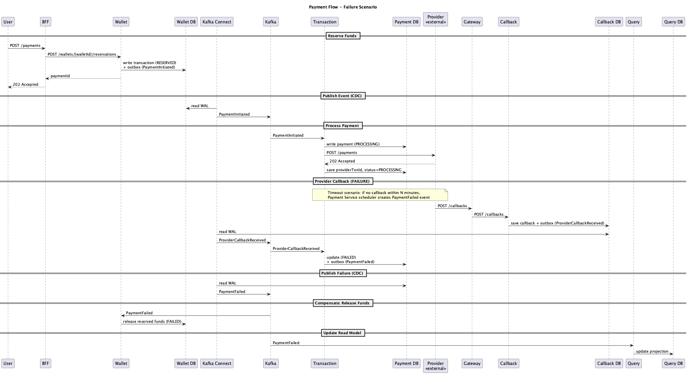
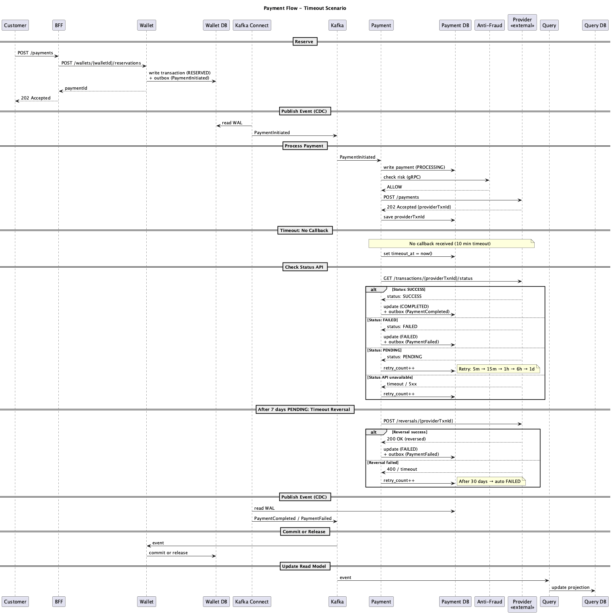

# Payment Flow

Пошаговый процесс обработки платежа. Реализует Saga через хореографию событий.

## Saga: шаги и компенсации

| Шаг         | Сервис   | Действие                         | Компенсация                         |
| ----------- | -------- | -------------------------------- | ----------------------------------- |
| 1. Reserve  | Wallet   | `reserved += amount`             | release: `reserved -= amount`       |
| 2. Process  | Payment  | Вызов провайдера                 | — (провайдер определяет результат)  |
| 3. Callback | Callback | Сохранить callback, опубликовать | — (нет состояния для компенсации)   |
| 4. Complete | Wallet   | commit или release               | — (финальный шаг)                   |

- **Success:** Reserve → Process → Callback → Commit
- **Failure:** Reserve → Process → Callback (failed) → Release
- **Timeout:** Reserve → Process → [Status API polling](#timeout) → Commit/Release

## Success

1. `POST /payments` → API Gateway → BFF
2. BFF → `POST /wallets/{walletId}/reservations` → Wallet Service
3. Wallet Service (одна транзакция):
   - `wallets.reserved += amount`
   - создаёт `reservations` (status=RESERVED)
   - пишет в `wallet_outbox` событие `PaymentInitiated`
4. Kafka Connect читает WAL → `PaymentInitiated` в Kafka
5. Payment Service читает `PaymentInitiated`, создаёт `payments` (status=PROCESSING)
6. Payment Service → Anti-Fraud Service (gRPC, sync) → ALLOW
7. Payment Service → External Provider → получает `providerTxnId`
8. External Provider → callback → API Gateway → Callback Service (status=SUCCESS)
9. Callback Service сохраняет callback, пишет `ProviderCallbackReceived` в outbox
10. Kafka Connect → `ProviderCallbackReceived` в Kafka
11. Payment Service обновляет `payments` (status=COMPLETED), пишет `PaymentCompleted`
12. Kafka Connect → `PaymentCompleted` в Kafka
13. Wallet Service: commit (reserved → balance)
14. Query Service обновляет `payment_projections`

## Failure

Failure может произойти на разных этапах:

### Anti-Fraud DENY

1-5. Аналогично Success
6. Payment Service → Anti-Fraud Service → **DENY**
7. Payment Service обновляет `payments` (status=FAILED), пишет `PaymentFailed`
8. Wallet Service: release (reserved -= amount)

### Provider недоступен

1-6. Аналогично Success
7. Payment Service → External Provider:
   - Timeout/5xx → retry до 3 раз с интервалом 1 сек
   - Все retry неудачны → FAILED
8. Payment Service обновляет `payments` (status=FAILED), пишет `PaymentFailed`
9. Wallet Service: release (reserved -= amount)

### Provider callback FAILED

1-7. Аналогично Success
8. Provider callback с status=FAILED
9. Callback Service → `ProviderCallbackReceived` в Kafka
10. Payment Service обновляет `payments` (status=FAILED), пишет `PaymentFailed`
11. Wallet Service: release (reserved -= amount)

## Timeout

1-7. Аналогично Success (до вызова провайдера включительно), но callback не приходит

8. Истекает таймаут ожидания callback'а (10 минут)
9. Payment Service запрашивает **Status API**:
   - SUCCESS → COMPLETED
   - FAILED → FAILED
   - PENDING → ждём, повтор через 5м, потом 15м, 1ч, 6ч, 1д
   - timeout/error → ждём, повтор с тем же расписанием

10. Если PENDING больше 7 дней — отправляем **Timeout Reversal**:
    - 200 OK (reversed) → FAILED
    - 400 (cannot reverse) / timeout → продолжаем ждать

Платёж остаётся в PROCESSING до получения финального ответа от провайдера. После 30 дней без ответа — автоматически FAILED, резерв возвращается пользователю.

11. Kafka Connect → событие в Kafka
12. Wallet Service: commit или release
13. Query Service обновляет `payment_projections`

См. [Consistency — Провайдер источник истины](consistency.md#3-провайдер--источник-истины)

## Transactional Outbox

Гарантирует атомарность: изменение состояния + публикация события.

| Сервис           | Outbox таблица    |
| ---------------- | ----------------- |
| Wallet Service   | `wallet_outbox`   |
| Payment Service  | `payment_outbox`  |
| Callback Service | `callback_outbox` |

**Как работает:**

1. В одной БД-транзакции: UPDATE состояния + INSERT в outbox
2. Kafka Connect (CDC) читает WAL и отправляет события в Kafka
3. После отправки — помечает запись как опубликованную

## CQRS

- **Write:** Wallet, Payment, Callback — каждый пишет в свою БД
- **Read:** Query Service строит проекции из событий

Query Service подписан на все события и обновляет `payment_projections` для быстрых запросов.

## Уведомления

После завершения платежа (PaymentCompleted / PaymentFailed):

| Сервис                    | Получатель | Канал      |
| ------------------------- | ---------- | ---------- |
| Notification Service      | Клиент     | Push / SMS |
| Merchant Callback Service | Мерчант    | HTTP POST  |

Оба сервиса — Kafka consumers, не блокируют основной flow.
