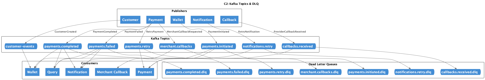
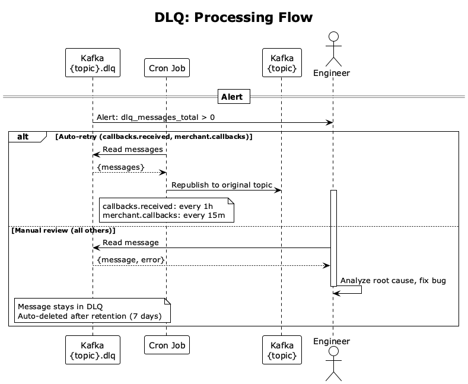

# Очереди, DLQ и Backpressure

Обработка событий, Dead Letter Queue и управление нагрузкой.

## Таблица потоков

| Поток / сценарий                                        | Топик               | DLQ                     | Обработка DLQ        |
| ------------------------------------------------------- | ------------------- | ----------------------- | -------------------- |
| Wallet -> Payment, Платёж создан                        | payments.initiated  | payments.initiated.dlq  | Manual review        |
| Payment -> Wallet, Query, Notification, Платёж завершён | payments.completed  | payments.completed.dlq  | Manual review        |
| Payment -> Wallet, Query, Notification, Платёж failed   | payments.failed     | payments.failed.dlq     | Manual review        |
| Callback -> Payment, Callback от провайдера             | callbacks.received  | callbacks.received.dlq  | Auto-retry через 1ч  |
| Payment -> Payment, Async retry                         | payments.retry      | payments.retry.dlq      | Manual review        |
| Payment -> Merchant, Merchant callback                  | merchant.callbacks  | merchant.callbacks.dlq  | Auto-retry через 15м |
| Notification -> Notification, Async retry               | notifications.retry | notifications.retry.dlq | Manual review        |

## Backpressure

### Ограничение конкурентных consumer-ов

Предпосылки (RPS, партиции, лимиты): [resilience.md](resilience.md#предпосылки).

| Consumer             | Instances | Threads | Узкое место                        |
| -------------------- | --------- | ------- | ---------------------------------- |
| Payment Service      | 6         | 12      | Внешний провайдер (rate limit)     |
| Wallet Service       | 6         | 12      | Запись в БД (масштабируем шардами) |
| Query Service        | 6         | 12      | Запись в read-model БД (шарды)     |
| Notification Service | 3         | 12      | Внешние провайдеры (rate limit)    |

- **Threads = 12** потому что partitions = 12. Один partition читает один thread — больше бессмысленно.
- **Instances:** 6 для критичных сервисов, 3 для Notification.

### Async Retry

Когда sync retries исчерпаны → сообщение уходит в `payments.retry` топик для async retry через Kafka.

Тайминги и детали: [resilience.md](resilience.md#payment--provider).

## DLQ (Dead Letter Queue)

Сервис не смог обработать сообщение из Kafka (баг, ошибка данных, downstream недоступен). Consumer отправляет сообщение в DLQ после 3 неудачных попыток обработки.

**Пример:** Payment Service читает из `payments.initiated`, но падает с ошибкой → после 3 retry Payment Service публикует сообщение в `payments.initiated.dlq`.

**Две политики обработки DLQ:**

| Политика      | DLQ топики                                     | Что происходит                               |
| ------------- | ---------------------------------------------- | -------------------------------------------- |
| Manual review | payments.\*, notifications.retry.dlq           | Алерт, инженер анализирует, retention 7 дней |
| Auto-retry    | callbacks.received.dlq, merchant.callbacks.dlq | Cron переотправляет в оригинальный топик     |

**Почему разные политики:**

- **Manual review** для payment events: ошибка обработки `PaymentInitiated` или `PaymentCompleted` — скорее баг в коде или проблема с данными. Автоматический retry не поможет, нужен анализ.
- **Auto-retry** для callbacks: внешние события от провайдера или для мерчанта. Ошибка может быть transient (сеть, временная недоступность). Retry имеет смысл.

**Retention:** 7 дней. Сообщения удаляются автоматически.

