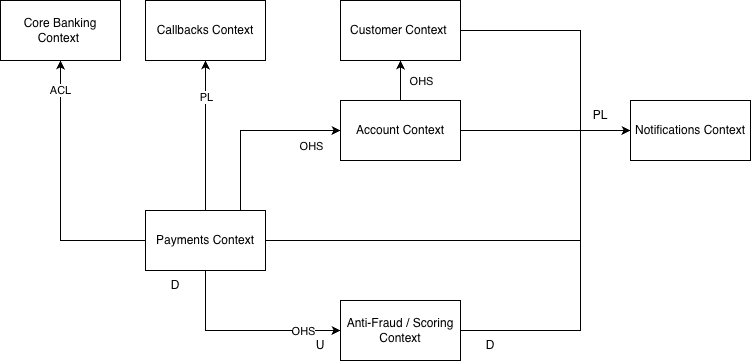

# Week 1

## sync/async, rest/grpc

**Client → API Gateway → BFF → Payments**

1. sync/async
   синхронно, пользователь ждет ответа сразу, и как можно быстрее
2. rest/grpc

- браузер, mobile app лучше поддержат http.
- api gateway хорошо работает с http, хуже с grpc. http cache, firewalls.
- bff должен отдавать в api gateway http, если payments будут отдавать protobuff, protobuff -> json будет лишняя операция
- bff нужно отдавать документацию для клиентов, легче отдать openapi spec

3. eventual consistency/sync consistency
   sync consistency, данные только в Payments DB

**Payments ↔ Account (резервирование/списание)**

1. sync/async
   hold/capture должен быть синхронным, payments не может продолжить без ответа от account. если нет денег - сразу отдать отказ
2. rest/grpc
   внутренний сервис, можно grpc для ускорения.
3. eventual consistency/sync consistency
   sync consistency, hold должен быть записан в бд до продолжения платежа, если отдать hold 200 ответ в payments до записи, то возможно двойное списание

**Payments → Anti-Fraud/Scoring**

1. sync/async
   сихронно, payments должен сразу прекращать платеж, если anti-fraud заподозрил мошенничество
2. rest/grpc
   grpc, внутренний сервис, скорость важна.
3. eventual consistency/sync consistency
   sync consistency, payments ждет решения от anti-fraud

**Payments → Core Banking ACL**

1. sync/async
   async, запись бухучету не нужна скорость, отдать в acl и забыть
2. rest/grpc

-

3. eventual consistency/sync consistency
   eventual consistency, но с гарантией доставки. при async коммунникации только eventual consistency

**Payments → Notifications**

1. sync/async
   async, потому что не так важна скорость доставки, мы не можем гарантировать быстрый респонс от sms/email/push
   можно sync и отдавать 202, но тогда можно потерять сообщение, если в Notifications сбой, а в kafka событие подождет
2. rest/grpc

-

3. eventual consistency/sync consistency
   async => eventual consistency

**Payments → Callbacks (мерчантам)**

1. sync/async
   async, мерчант - внешняя система, может быть недоступна, платеж не должен зависеть от мерчанта

2. rest/grpc

-

3. eventual consistency/sync consistency
   async => eventual consistency

**Payments → DWH/Аналитика**

1. sync/async
   async, отослать и забыть
2. rest/grpc

-

3. eventual consistency/sync consistency
   async => eventual consistency

## kafka vs rabbitmq

**PaymentCompleted → Notifications**

1. Kafka или RabbitMQ?
   Kafka

2. Тип сообщений? event/command/job
   Event (доменное событие — факт свершился)

3. Обоснование:

- Много подписчиков на это событие (Notifications, DWH, Core Banking, Anti-Fraud (training)...). 1 топик вместо n очередей.
- Нужно durability сообщений, чтобы перечитать, если Notifications по каким-то причинам потерял
- Порядок важен, событие paymentcompleted должно быть после начала платежа

**PaymentCreated → Anti-Fraud**

PaymentCreated - событие уже после Anti-Fraud approve.

1. Kafka или RabbitMQ?
   Kafka

2. Тип сообщений?
   Event

3. Обоснование:

- Много подписчиков на это событие (Notifications, DWH, Core Banking, Anti-Fraud (training)...). 1 топик вместо n очередей.

**Телеметрия/лог транзакций**

1. Kafka или RabbitMQ?
   Kafka

2. Тип сообщений?
   Event (логи, метрики)

3. Обоснование:

- Огромный объём данных, Kafka рассчитана на стриминговую аналитику
- подписчики (DWH, ...) читают независимо

**Очередь генерации отчётов**

1. Kafka или RabbitMQ?
   RabbitMQ

2. Тип сообщений?
   Command/Job

3. Обоснование:

- RabbitMQ часто применяют для управления заданиями
- Один получатель на задание
- Приоритеты: срочные отчёты вперёд
- TTL: устаревшие задания можно отбросить (часы, а не дни как в kafka)
- Не нужно хранить задания после ack — отчёт сгенерирован и готов

**Callbacks retry (тяжёлые повторы)**

1. Kafka или RabbitMQ?
   RabbitMQ

2. Тип сообщений?
   Command/Job

3. Обоснование:

- TTL + delayed retry (отложенная повторная отправка)
