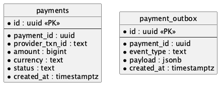
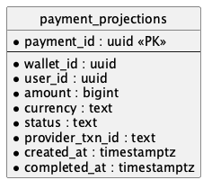

# Payment Platform

Система обработки платежей с eventual consistency, Saga, Transactional Outbox и CQRS.

## Архитектура

### C2 Container Diagram


| Bounded Context    | Ответственность                       | Команды                                 | Слушает события                                   | Публикует события               |
| ------------------ | ------------------------------------- | --------------------------------------- | ------------------------------------------------- | ------------------------------- |
| Wallet             | Управление балансом, резервирование   | ReserveFunds, CommitFunds, ReleaseFunds | PaymentCompleted, PaymentFailed                   | PaymentInitiated                |
| Payment            | Взаимодействие с провайдером          | InitiatePayment                         | PaymentInitiated, ProviderCallbackReceived        | PaymentCompleted, PaymentFailed |
| Callback           | Приём callback от провайдера          | HandleCallback                          | —                                                 | ProviderCallbackReceived        |
| Query (Read Model) | Денормализованные проекции для чтения | —                                       | PaymentInitiated, PaymentCompleted, PaymentFailed | —                               |

### C3 Component Diagrams

#### Wallet Service


#### Transaction Service


#### Query Service


## Sequence Diagrams

### Success Scenario


### Failure Scenario


Отличия от success:

- Provider callback со статусом FAILED
- Transaction пишет PaymentFailed в outbox
- Wallet делает компенсацию — release reserved funds
- Timeout обрабатывается аналогично — scheduler в Transaction Service создаёт PaymentFailed

### Callback Flow

Отдельная диаграмма для callback flow не создавалась, т.к. он полностью виден в seq-success и seq-failure.

## API

### External API (BFF)

#### Create Payment

```
POST /payments
```

Request:

```json
{
  "walletId": "uuid",
  "amount": 1000,
  "currency": "RUB",
  "recipient": {
    "accountNumber": "40817810099910004312",
    "bankBic": "044525225",
    "name": "Иванов Иван Иванович"
  }
}
```

Response `202 Accepted`:

```json
{
  "paymentId": "uuid",
  "status": "RESERVED"
}
```

#### Get Payment Status

```
GET /payments/{paymentId}
```

Response `200 OK`:

```json
{
  "paymentId": "uuid",
  "walletId": "uuid",
  "userId": "uuid",
  "amount": 1000,
  "currency": "RUB",
  "status": "COMPLETED",
  "errorCode": null,
  "providerTxnId": "uuid",
  "createdAt": "2024-01-15T10:00:00Z",
  "completedAt": "2024-01-15T10:00:05Z"
}
```

Status values: `RESERVED`, `PROCESSING`, `COMPLETED`, `FAILED`

#### Get Payment History

```
GET /payments?walletId={walletId}&limit=20&offset=0
```

Response `200 OK`:

```json
{
  "payments": [
    {
      "paymentId": "uuid",
      "walletId": "uuid",
      "userId": "uuid",
      "amount": 1000,
      "currency": "RUB",
      "status": "COMPLETED",
      "errorCode": null,
      "providerTxnId": "uuid",
      "createdAt": "2024-01-15T10:00:00Z",
      "completedAt": "2024-01-15T10:00:05Z"
    }
  ],
  "total": 100,
  "limit": 20,
  "offset": 0
}
```

### Internal API

#### Wallet Service

**Reserve Funds**

```
POST /wallets/{walletId}/reservations
```

Request:

```json
{
  "paymentId": "uuid",
  "amount": 1000,
  "currency": "RUB"
}
```

Response `201 Created`:

```json
{
  "reservationId": "uuid",
  "paymentId": "uuid",
  "status": "RESERVED"
}
```

**Commit Funds** — вызывается через Kafka event (`PaymentCompleted`), не HTTP.

**Release Funds** — вызывается через Kafka event (`PaymentFailed`), не HTTP.

#### Transaction Service

Не имеет HTTP эндпоинтов, подписан на `PaymentInitialized`, `ProviderCallbackReceived` ивенты из брокера.

#### Callback Service

```
POST /callbacks
```

Request (from Payment Provider):

```json
{
  "providerTxnId": "uuid",
  "status": "SUCCESS",
  "timestamp": "2024-01-15T10:00:05Z",
  "signature": "..."
}
```

Response `200 OK`:

```json
{
  "received": true
}
```

## ERD

### Wallet DB


#### wallets

| Field      | Type        | Описание                                |
| ---------- | ----------- | --------------------------------------- |
| id         | uuid        | Первичный ключ кошелька                 |
| user_id    | uuid        | Владелец кошелька                       |
| balance    | bigint      | Доступный баланс в минимальных единицах |
| reserved   | bigint      | Зарезервированная сумма                 |
| currency   | text        | Код валюты (RUB, USD, ...)              |
| created_at | timestamptz | Время создания                          |

#### wallet_transactions

| Field      | Type        | Описание                                        |
| ---------- | ----------- | ----------------------------------------------- |
| id         | uuid        | Первичный ключ                                  |
| wallet_id  | uuid        | FK на wallets                                   |
| payment_id | uuid        | ID платежа, защита от повторного резервирования |
| amount     | bigint      | Сумма в копейках/центах/...                     |
| type       | text        | RESERVE, COMMIT, RELEASE                        |
| status     | text        | PENDING, COMPLETED, FAILED                      |
| created_at | timestamptz | Время создания                                  |

#### wallet_outbox

| Field      | Type        | Описание                                   |
| ---------- | ----------- | ------------------------------------------ |
| id         | uuid        | Первичный ключ                             |
| payment_id | uuid        | ID платежа                                 |
| event_type | text        | Название события (всегда PaymentInitiated) |
| payload    | jsonb       | Данные события в формате JSON              |
| created_at | timestamptz | Время создания                             |

### Transaction DB



#### payments

| Field           | Type        | Описание                               |
| --------------- | ----------- | -------------------------------------- |
| id              | uuid        | Первичный ключ                         |
| payment_id      | uuid        | ID платежа из Wallet, защита от дублей |
| provider_txn_id | text        | ID транзакции от провайдера            |
| amount          | bigint      | Сумма в копейках/центах/...            |
| currency        | text        | Код валюты                             |
| status          | text        | PROCESSING, COMPLETED, FAILED          |
| error_code      | text        | Код ошибки                             |
| created_at      | timestamptz | Время создания                         |

#### payment_outbox

| Field      | Type        | Описание                                   |
| ---------- | ----------- | ------------------------------------------ |
| id         | uuid        | Первичный ключ                             |
| payment_id | uuid        | ID платежа                                 |
| event_type | text        | Название события (PaymentCompleted/Failed) |
| payload    | jsonb       | Данные события в формате JSON              |
| created_at | timestamptz | Время создания                             |

### Callback DB


#### callbacks

| Field           | Type        | Описание                    |
| --------------- | ----------- | --------------------------- |
| id              | uuid        | Первичный ключ              |
| provider_txn_id | text        | ID транзакции от провайдера |
| status          | text        | SUCCESS, FAILED             |
| raw_payload     | jsonb       | Сырой ответ от провайдера   |
| received_at     | timestamptz | Время получения             |

#### callback_outbox

| Field           | Type        | Описание                                    |
| --------------- | ----------- | ------------------------------------------- |
| id              | uuid        | Первичный ключ                              |
| provider_txn_id | text        | ID транзакции от провайдера                 |
| event_type      | text        | Название события (ProviderCallbackReceived) |
| payload         | jsonb       | Данные события в формате JSON               |
| created_at      | timestamptz | Время создания                              |

### Query DB



#### payment_projections

| Field           | Type        | Описание                                |
| --------------- | ----------- | --------------------------------------- |
| payment_id      | uuid        | Первичный ключ                          |
| wallet_id       | uuid        | ID кошелька отправителя                 |
| user_id         | uuid        | ID пользователя                         |
| amount          | bigint      | Сумма в копейках/центах/...             |
| currency        | text        | Код валюты                              |
| status          | text        | RESERVED, PROCESSING, COMPLETED, FAILED |
| error_code      | text        | Код ошибки                              |
| provider_txn_id | text        | ID транзакции от провайдера             |
| created_at      | timestamptz | Время создания платежа                  |
| completed_at    | timestamptz | Время завершения                        |

- GET /payments/{paymentId} => "SELECT \* FROM payment_projections WHERE payment_id = ?"
- GET /payments?walletId={walletId} => "SELECT \* FROM payment_projections WHERE wallet_id = ? ORDER BY created_at DESC LIMIT ? OFFSET ?"

## Events

### PaymentInitiated

Публикует Wallet Service после резервирования средств.

| Поле                    | Тип    | Описание                    |
| ----------------------- | ------ | --------------------------- |
| paymentId               | string | ID платежа                  |
| walletId                | string | ID кошелька                 |
| userId                  | string | ID пользователя             |
| amount                  | number | Сумма в копейках/центах/... |
| currency                | string | Код валюты                  |
| recipient               | object | Данные получателя           |
| recipient.accountNumber | string | Номер счёта                 |
| recipient.bankBic       | string | БИК банка                   |
| recipient.name          | string | ФИО получателя              |
| createdAt               | string | Время создания              |

### PaymentCompleted

Публикует Transaction Service после успешного callback от провайдера.

| Поле          | Тип    | Описание                    |
| ------------- | ------ | --------------------------- |
| paymentId     | string | ID платежа                  |
| providerTxnId | string | ID транзакции от провайдера |
| completedAt   | string | Время завершения            |

### PaymentFailed

Публикует Transaction Service после неуспешного callback или таймаута.

| Поле          | Тип    | Описание                                       |
| ------------- | ------ | ---------------------------------------------- |
| paymentId     | string | ID платежа                                     |
| providerTxnId | string | ID транзакции от провайдера (null при timeout) |
| errorCode     | string | Код ошибки                                     |
| completedAt   | string | Время завершения                               |

### ProviderCallbackReceived

Публикует Callback Service после получения callback от провайдера.

| Поле          | Тип    | Описание                    |
| ------------- | ------ | --------------------------- |
| providerTxnId | string | ID транзакции от провайдера |
| status        | string | SUCCESS, FAILED             |
| receivedAt    | string | Время получения             |

## Процесс исполнения платежа

**Success**:

1. POST /payments с клиента на API Gateway → BFF. Body: amount, walletId, currency, recipient.
2. POST /wallets/{walletId}/reservations с BFF на Wallet Service.
3. Wallet Service в одной транзакции: увеличивает wallets.reserved, создаёт запись в wallet_transactions (type=RESERVE, status=COMPLETED), пишет в wallet_outbox событие PaymentInitiated.
4. Kafka Connect читает WAL, отправляет PaymentInitiated в Kafka.
5. Transaction Service читает PaymentInitiated, создаёт запись в payments (status=PROCESSING).
6. Transaction Service вызывает External Provider по HTTP, передаёт callback URL, получает 202 Accepted с providerTxnId.
7. Transaction Service обновляет payments.provider_txn_id.
8. External Provider делает callback через API Gateway в Callback Service (status=SUCCESS).
9. Callback Service сохраняет callback, пишет в outbox событие ProviderCallbackReceived.
10. Kafka Connect читает WAL из Callback DB, отправляет ProviderCallbackReceived в Kafka.
11. Transaction Service читает событие, обновляет payments (status=COMPLETED), пишет в payment_outbox событие PaymentCompleted.
12. Kafka Connect читает WAL, отправляет PaymentCompleted в Kafka.
13. Wallet Service читает PaymentCompleted, в одной транзакции: уменьшает wallets.reserved, уменьшает wallets.balance, создаёт запись в wallet_transactions (type=COMMIT, status=COMPLETED).
14. Query Service читает PaymentCompleted, обновляет payment_projections.

**Failure**:

1-7. Аналогично Success.

8. External Provider делает callback через API Gateway в Callback Service (status=FAILED). Или callback не приходит (timeout).
9. Аналогично Success (ProviderCallbackReceived с status=FAILED). При timeout — Transaction Service по таймеру сам создаёт PaymentFailed.
10. Аналогично Success.
11. Transaction Service читает событие, обновляет payments (status=FAILED, error_code), пишет в payment_outbox событие PaymentFailed.
12. Kafka Connect читает WAL, отправляет PaymentFailed в Kafka.
13. Wallet Service читает PaymentFailed, в одной транзакции: уменьшает wallets.reserved, создаёт запись в wallet_transactions (type=RELEASE, status=COMPLETED).
14. Query Service читает PaymentFailed, обновляет payment_projections.

## Saga

Используется хореография — нет центрального оркестратора, сервисы слушают события и сами решают, что делать.

### Шаг 1: Reserve (Wallet Service)

- **Локальная транзакция:** увеличить wallets.reserved, создать wallet_transactions (type=RESERVE), записать в wallet_outbox (PaymentInitiated)
- **Компенсация:** уменьшить wallets.reserved, создать wallet_transactions (type=RELEASE)

### Шаг 2: Process (Transaction Service)

- **Локальная транзакция:** создать payments (status=PROCESSING), вызвать провайдера, сохранить provider_txn_id
- **Компенсация:** нет. Провайдер — внешняя система, мы не можем отменить запрос. Провайдер сам возвращает SUCCESS или FAILED, это не компенсация, а результат.

### Завершение саги (Wallet Service)

По результату шага 2:

- **PaymentCompleted** → COMMIT: уменьшить wallets.reserved, уменьшить wallets.balance, создать wallet_transactions (type=COMMIT)
- **PaymentFailed** → RELEASE: уменьшить wallets.reserved, создать wallet_transactions (type=RELEASE)

## Outbox

1. Wallet Service — wallet_outbox
2. Transaction Service — payment_outbox
3. Callback Service — callback_outbox

Callback Service использует outbox, чтобы гарантировать доставку события в Kafka.

Без outbox: если Callback Service получил callback, ответил провайдеру 200 OK, но упал до отправки в Kafka — событие потеряется.

С outbox: сохранение callback и запись в outbox происходят в одной транзакции, CDC гарантирует доставку.

### Polling vs CDC

[См ADR](adr/004-cdc-over-polling.md).

## Idempotency

Все проверки идемпотентности хранят состояние в PostgreSQL. Логика проверки — на уровне приложения.

- Wallet Service — `SELECT ... WHERE payment_id = ? AND type = 'RESERVE'` перед созданием резерва. Если найдено — возвращает существующий результат. 
- Transaction Service — UNIQUE constraint на `payment_id` в таблице payments. При дубликате INSERT падает, сервис возвращает существующий статус.
- Callback Service — UNIQUE constraint на `provider_txn_id` в таблице callbacks. Дубликат callback игнорируется.

## CQRS

- **Write:** Wallet Service, Transaction Service, Callback Service — каждый пишет в свою БД
- **Read:** Query Service — читает из payment_projections, денормализованная таблица, вставки при получении событий кафки

Индексы в Query DB:

- `payment_id` — PK, поиск по ID платежа
- `CREATE INDEX idx_payment_projections_wallet_created ON payment_projections (wallet_id, created_at DESC);` — история платежей кошелька с сортировкой
