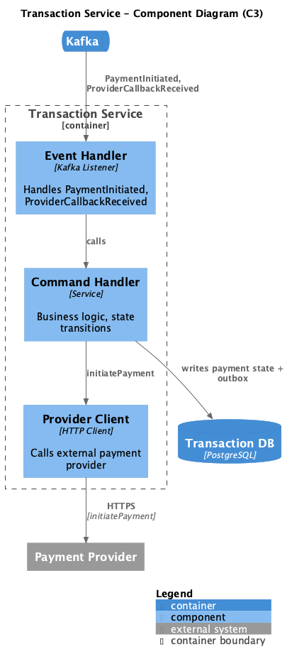
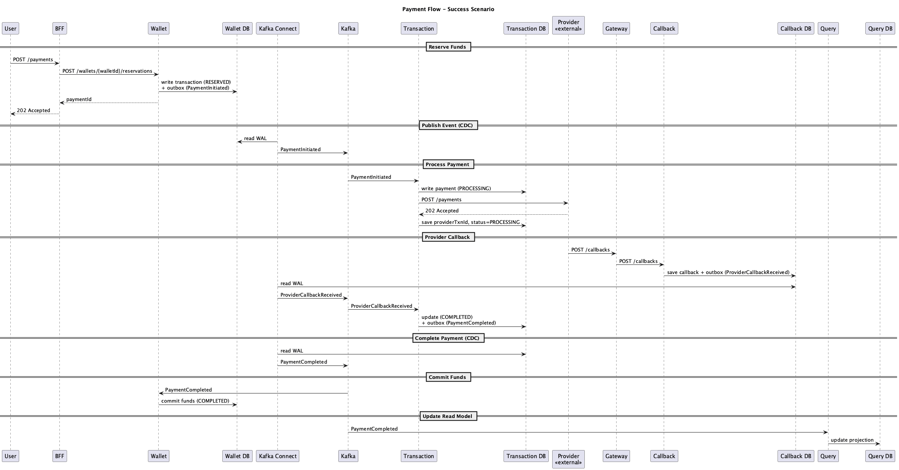
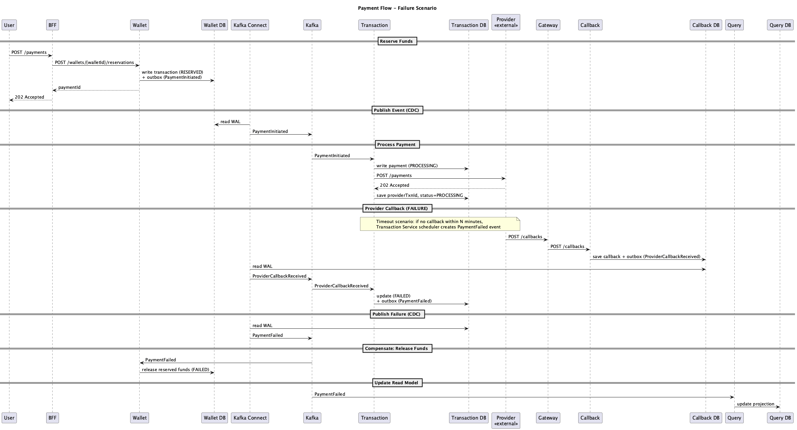

# Payment Platform

Система обработки платежей с eventual consistency, Saga, Transactional Outbox и CQRS.

## Архитектура

### C2 Container Diagram


### C3 Component Diagrams

#### Wallet Service


#### Transaction Service



#### Query Service


## Sequence Diagrams

### Success Scenario



### Failure Scenario



Отличия от success:

- Provider callback со статусом FAILED
- Transaction пишет PaymentFailed в outbox
- Wallet делает компенсацию — release reserved funds
- Timeout обрабатывается аналогично — scheduler в Transaction Service создаёт PaymentFailed

### Callback Flow

Отдельная диаграмма для callback flow не создавалась, т.к. он полностью виден в seq-success и seq-failure.

## API

### External API (BFF)

#### Create Payment

```
POST /payments
```

Request:

```json
{
  "walletId": "uuid",
  "amount": 1000,
  "currency": "RUB",
  "recipient": {
    "accountNumber": "40817810099910004312",
    "bankBic": "044525225",
    "name": "Иванов Иван Иванович"
  }
}
```

Response `202 Accepted`:

```json
{
  "paymentId": "uuid",
  "status": "RESERVED"
}
```

#### Get Payment Status

```
GET /payments/{paymentId}
```

Response `200 OK`:

```json
{
  "paymentId": "uuid",
  "walletId": "uuid",
  "amount": 1000,
  "currency": "RUB",
  "status": "COMPLETED",
  "createdAt": "2024-01-15T10:00:00Z",
  "completedAt": "2024-01-15T10:00:05Z"
}
```

Status values: `RESERVED`, `PROCESSING`, `COMPLETED`, `FAILED`

#### Get Payment History

```
GET /payments?walletId={walletId}&limit=20&offset=0
```

Response `200 OK`:

```json
{
  "payments": [
    {
      "paymentId": "uuid",
      "amount": 1000,
      "currency": "RUB",
      "status": "COMPLETED",
      "createdAt": "2024-01-15T10:00:00Z"
    }
  ],
  "total": 100,
  "limit": 20,
  "offset": 0
}
```

### Internal API

#### Wallet Service

**Reserve Funds**

```
POST /wallets/{walletId}/reservations
```

Request:

```json
{
  "paymentId": "uuid",
  "amount": 1000,
  "currency": "RUB"
}
```

Response `201 Created`:

```json
{
  "reservationId": "uuid",
  "paymentId": "uuid",
  "status": "RESERVED"
}
```

**Commit Funds** — вызывается через Kafka event (`PaymentCompleted`), не HTTP.

**Release Funds** — вызывается через Kafka event (`PaymentFailed`), не HTTP.

#### Transaction Service

Не имеет HTTP эндпоинтов, подписан на `PaymentInitialized`, `ProviderCallbackReceived` ивенты из брокера.

#### Callback Service

```
POST /callbacks
```

Request (from Payment Provider):

```json
{
  "providerTxnId": "uuid",
  "status": "SUCCESS",
  "timestamp": "2024-01-15T10:00:05Z",
  "signature": "..."
}
```

Response `200 OK`:

```json
{
  "received": true
}
```

## ERD

### Wallet DB


#### wallets

| Field      | Type        | Описание                                |
| ---------- | ----------- | --------------------------------------- |
| id         | uuid        | Первичный ключ кошелька                 |
| user_id    | uuid        | Владелец кошелька                       |
| balance    | bigint      | Доступный баланс в минимальных единицах |
| reserved   | bigint      | Зарезервированная сумма                 |
| currency   | text        | Код валюты (RUB, USD, ...)              |
| created_at | timestamptz | Время создания                          |

#### wallet_transactions

| Field      | Type        | Описание                                        |
| ---------- | ----------- | ----------------------------------------------- |
| id         | uuid        | Первичный ключ                                  |
| wallet_id  | uuid        | FK на wallets                                   |
| payment_id | uuid        | ID платежа, защита от повторного резервирования |
| amount     | bigint      | Сумма в копейках/центах/...                     |
| type       | text        | RESERVE, COMMIT, RELEASE                        |
| status     | text        | PENDING, COMPLETED, FAILED                      |
| created_at | timestamptz | Время создания                                  |

#### wallet_outbox

| Field      | Type        | Описание                            |
| ---------- | ----------- | ----------------------------------- |
| id         | uuid        | Первичный ключ                      |
| payment_id | uuid        | ID платежа                          |
| event_type | text        | Название события (PaymentInitiated) |
| payload    | jsonb       | Данные события в формате JSON       |
| created_at | timestamptz | Время создания                      |
